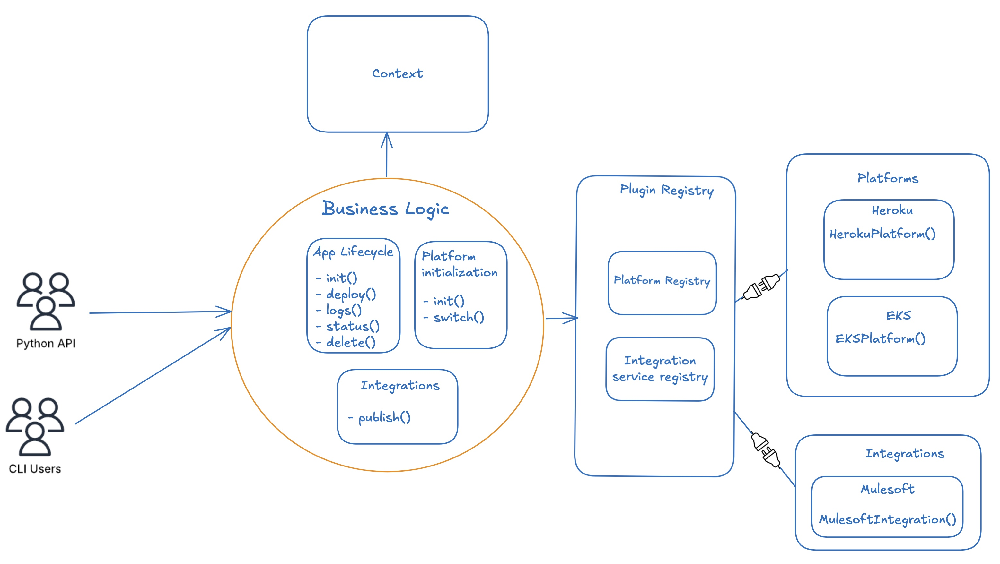

# Core Architecture

!!! info "🏗️ Architecture Overview"

    SFAI SDK uses a **plugin-based architecture** for platforms and integrations. All official plugins are bundled with the SDK for convenience, but the system is designed for extensibility.

{ .center }

*SFAI SDK Plugin-Based Architecture*{ .center }

---

## 🔌 Plugin-Based Platform System

SFAI SDK uses a **plugin-based architecture** for platform and integration support.
**All platform plugins must inherit from `BasePlatform`**, which acts as the contract for platform features.

### ⚙️ How It Works

=== "🎯 Core Engine"

    **Handles app lifecycle, context, deployment orchestration, and CLI/API interfaces.**

    ```python
    # Core responsibilities
    - App lifecycle management
    - Context and state handling
    - Deployment orchestration
    - CLI/API interface provision
    ```

=== "🧩 Platform Plugins"

    **Each platform is a separate module that inherits from `BasePlatform`**

    ```python
    # Platform examples
    - Heroku Plugin
    - AWS Plugin
    - Local Docker Plugin
    - Custom Enterprise Plugin
    ```

    All plugins implement: `init`, `deploy`, `delete`, `status`, `logs`, `open`

=== "📝 Entrypoint Registration"

    **Each platform must be registered in `pyproject.toml`**

    ```toml
    [project.entry-points."sfai.platforms"]
    heroku = "sfai.platform.providers.heroku.platform:HerokuPlatform"
    aws = "sfai.platform.providers.aws.platform:AWSPlatform"
    local = "sfai.platform.providers.local.platform:LocalPlatform"
    ```

=== "🔄 Dynamic Loading"

    **Auto-discovery and loading of all registered platforms**

    ```python
    # Runtime platform discovery
    entry_points = pkg_resources.iter_entry_points('sfai.platforms')
    platforms = {ep.name: ep.load() for ep in entry_points}
    ```

### ✨ Benefits

!!! success "🚀 Extensibility"
    New platforms can be added as plugins without modifying the core engine.

!!! tip "🛡️ Stability"
    Changes to platform plugins do not impact the core SDK logic.

!!! note "🎨 Customization"
    Organizations can fork or extend platform plugins for their needs.

---

## 🏗️ Base Implementations

!!! abstract "Core Base Classes"

    === "📱 BaseApp"

        **Abstract base for app-level operations**

        ```python
        class BaseApp:
            """Abstract base for application operations"""
            pass
        ```

    === "🌐 BasePlatform"

        **Abstract base for all platform plugins**

        ```python
        class BasePlatform:
            def init(self, **kwargs) -> BaseResponse: ...
            def deploy(self, context, **kwargs) -> BaseResponse: ...
            def delete(self, context) -> BaseResponse: ...
            def status(self, context) -> BaseResponse: ...
            def logs(self, context) -> BaseResponse: ...
            def open(self, context, **kwargs) -> BaseResponse: ...
        ```

    === "🔗 BaseIntegration"

        **Abstract base for integrations (e.g., MuleSoft)**

        ```python
        class BaseIntegration:
            """Abstract base for external integrations"""
            pass
        ```

    === "📋 BaseResponse"

        **Standard response model for all operations**

        ```python
        class BaseResponse:
            success: bool
            message: str
            error: Optional[str]
            data: Optional[Dict]
        ```

---

## 🛠️ How to Add a New Platform Plugin

!!! tip "Step-by-Step Guide"

    === "1️⃣ Create Module"

        **Create a new provider module:**

        ```bash
        # Create directory structure
        mkdir -p sfai/platform/providers/<your_platform>/
        touch sfai/platform/providers/<your_platform>/platform.py
        ```

        ```python
        # Implement your platform class
        from sfai.core.base import BasePlatform

        class YourPlatform(BasePlatform):
            # Implement all required methods
            pass
        ```

    === "2️⃣ Register Platform"

        **Add to pyproject.toml entry points:**

        ```
